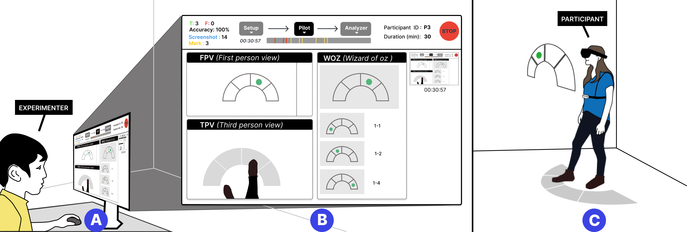

# PilotAR
A toolkit for experimenters to conduct pilot studies more efficiently with AR smart glasses (Optical See-Through Head-Mounted Displays)

- If you find any issues, please create GitHub [issues](https://github.com/Synteraction-Lab/PilotAR/issues) 


## Publications
- [PilotAR: Streamlining Pilot Studies with OHMDs from Concept to Insight](https://doi.org/10.1145/3678576), IMWUT'24
  - Camera Ready [PDF](paper/IMWUT24_PilotAR.pdf)
  - [POSTER](paper/PilotAR_poster.pdf)
```
@article{janaka_pilotar_2024,
	title = {{PilotAR}: {Streamlining} {Pilot} {Studies} with {OHMDs} from {Concept} to {Insight}},
	shorttitle = {{PilotAR}},
	url = {https://doi.org/10.1145/3678576},
	doi = {10.1145/3678576},
	language = {en},
	journal = {Proceedings of the ACM on Interactive, Mobile, Wearable and Ubiquitous Technologies},
	author = {Janaka, Nuwan and Cai, Runze and Ram, Ashwin and Zhu, Lin and Zhao, Shengdong and Kai Qi, Yong},
	month = sep,
	year = {2024},
}
```
- [Demonstrating PilotAR: A Tool to Assist Wizard-of-Oz Pilot Studies with OHMD](https://doi.org/10.1145/3675094.3677554), UbiComp/ISWC'24
  - Camera Ready [PDF](paper/UbiComp24_Demonstrating_PilotAR.pdf)

- Video: [](https://youtu.be/6Ta_eWziOyo)


## Contact person
- [Nuwan Janaka](https://synteraction.org/our-team) ([In](https://www.linkedin.com/in/nuwan-janaka/))
- [Cai Runze](https://synteraction.org/our-team)


## Contributors
- Initial contributors: [@RenzoTsai](https://www.github.com/RenzoTsai), [@flairekq](https://www.github.com/SherisseTJW), [@tsy24](https://www.github.com/tsy24), [@janakanuwan](https://www.github.com/janakanuwan), [@wowsiddanth](https://www.github.com/wowsiddanth)


## Project links
- Documentation: [here](https://docs.google.com/presentation/d/18W6QEvvQTLHl7Hf6uT8z5MNWrjOWcaP5SRqOvsnnRr4/view?usp=sharing)
  - See `Sample Setup` in the documentation for the setup of the tool.
- Tool usage: [offline video](docs/WOzTool_user_guide.mp4)
- Project folder (private access): [here](https://drive.google.com/drive/folders/1vBHP0YW2hwhJSStCFvWi4LTjTzqru6VU?usp=sharing)
- [Version info](VERSION.md)


## Requirements
- A computer with `Windows` (10/11) OR `MacOS`
- For `MacOS`
  - Please install [vb-cable](https://vb-audio.com/Cable/index.htm) to enable you to record your computer's sound.
  - Give access to enable your terminal or IDE (e.g., PyCharm) Input Monitoring and Screen Recording in System Settings -> Privacy & Security.
- For `Windows`
  - Please enable [Stereo Mix](https://www.itechtics.com/stereo-mix/) to allow you to record your computer's sound.
- Currently, the tool support HoloLens 2 device for first-person view (or webcam using `0` as the IP address). So, you need to know the smart glasses' IP address, username, and password. If you forgot, [request a new pin](https://learn.microsoft.com/en-us/windows/mixed-reality/develop/advanced-concepts/using-the-windows-device-portal#creating-a-username-and-password) via Windows Device Portal


## Installation & Preparation
1. Install `conda`, if you haven't done it (e.g., [Miniconda](https://docs.conda.io/en/latest/miniconda.html)).
2. Create conda environment `woz` via `conda env create -f environment.yml`.
3. Activate `woz` environment via `conda activate woz`
4. Install [VLC Player](https://www.videolan.org/vlc/)
5. Install [FFmpeg](https://ffmpeg.org/) and add it to your environment path.
  - For macOS, you can use [`brew install ffmpeg`](https://formulae.brew.sh/formula/ffmpeg)
  - For Windows, you may need to [manually add it to the environment variable](https://phoenixnap.com/kb/ffmpeg-windows).


## Execution (Running the WOzTool)
- See WOzTool usage: [offline video](docs/WOzTool_user_guide.mp4)

### On Your Computer (PC/Mac)
1. Run `main.py` (e.g., `python main.py` via terminal)
2. You can set up the configurations by clicking `Setup` (e.g., [sample setup](https://docs.google.com/presentation/d/18W6QEvvQTLHl7Hf6uT8z5MNWrjOWcaP5SRqOvsnnRr4/view#slide=id.g217a74f75d0_1_9)).
   1. The device configuration, including FPV, TPV, Woz Interface address, and recording sources, can be modified in `Devices`.
      1. Enter your HoloLens' IP, Username, Password to the FPV's enter box. Then click `FPV` (blue button) to connect.
      2. For the TPV, you can create a Google meet and paste the link to the enter box of TPV. Then click `TPV` (blue button) to open the link in browser.
      3. Use your phone to join the Google Meet to provide a TPV.
      4. For the Woz interface, you can share this interface's window in Google Meet.
   2. You can also set up the checklist by clicking `Checklist`.
   3. To customize the `Annotations` for the pilot recording, you can click `Customization`
3. To start the pilot study, you can click `Pilot` in the top panel. 
   1. In the GUI, you can modify the ``Anticipated duration (in seconds)``, ``Participant & Session ID``. 
   2. You can then click ``Start`` to start one session. 
   3. Add annotations according to your study needs (e.g., Screenshots -> `shortcut key "5"`, Accuracy -> `shortcut key "1/2"` by default)
   4. Once you finish one session, you can click ``Stop``.
   5. You can modify the ``Participant & Session ID`` and click ``Start`` again to start new session.
4. You can then analyze the recordings after pilot. The program will automatically pop up the analyzer. 
   - You can also click the `Analyzer` in the top panel to open the analyzer's window.
5. To run PilotAR as an (independent) video analyzer/annotator, open the `Analyzer`, and then select the ``Create new`` option in the dropdown menu for ``Participant & Session ID``.

### On Your HoloLens (HL2)
1. Open the browser and join a Google Meet (we suggest you save this link to the bookmarks).
    - To minimize the typing in HL2, you can open the browser in computer (not HL2) and type IP address of HL2 to enter [Windows Device Portal](https://learn.microsoft.com/en-us/windows/uwp/debug-test-perf/device-portal)
    - Then select `Virtual Input` and copy the Google Meet link on that input and send it to HL2.
2. Turn on the Speaker and turn off the camera in the Google Meet.
    -  You DO NOT need to log into Google account to use Google Meet, but then need to type a name to join the meeting.
3. Change the Google Meet layout to enable your PC's shared screen can be full-sized display on the HoloLens.
   - Can use `Spotlight` and `Pin` functions on GoogleMeet to keep the required screens (e.g., shared, camera) in the center of the view.


## Known Issues & Solutions
- ``AttributeError: CFMachPortCreateRunLoopSource``
  - Follow this [link](https://github.com/moses-palmer/pynput/issues/55#issuecomment-924820627) to solve this problem

- Unclear images in the Analyzer UI
  - You can go to the file ``tkvideoplayer.py`` and the change ``self._resampling_method: int = Image.NEAREST`` to 
  ``self._resampling_method: int = Image.BICUBIC``.

- File is Missing on `Windows`
  - Virus guard (e.g., Microsoft Defender) blocks the customization file and will not run. 
  - Please need to allow the file in "Windows Security" / Antivirus software.

- Issue with video playing in the Analyzer UI on `Mac M1 chip`
  - Need to install VLC player's Intel version (Enable Rosetta for your terminal).

- Others, [WOzTool-feedback](https://docs.google.com/presentation/d/1BCrjZ0aK0cdfRXMJ3AMA2rNpBfOKQKUB4eWOmguZs78/view?usp=drive_link)


## Tests
To run unit test cases, run `python -m unittest` on the terminal


## References
- Credits to @jianfch for Utilities/stable_whisper.py (code from https://github.com/jianfch/stable-ts)
- Credits to aiortc team for Utilities/WOz_video_streaming_server.py (code from https://github.com/aiortc/aiortc/tree/main/examples/webcam)


## [Optional] Generate App (For `MacOS`)
1. In terminal, ``pip install py2app`` and run ``rm -rf build dist``.
2. Run ``python setup.py py2app -A``. Note: Please run this command with conda environment activated.
3. Go to the ``dist`` and open the App.
4. If they are any issues with the App, right-click the App's icon, then select ``Show Package Content`` and go to the ``Content\MacOS``. You can click ``main`` to run the program within the terminal.
